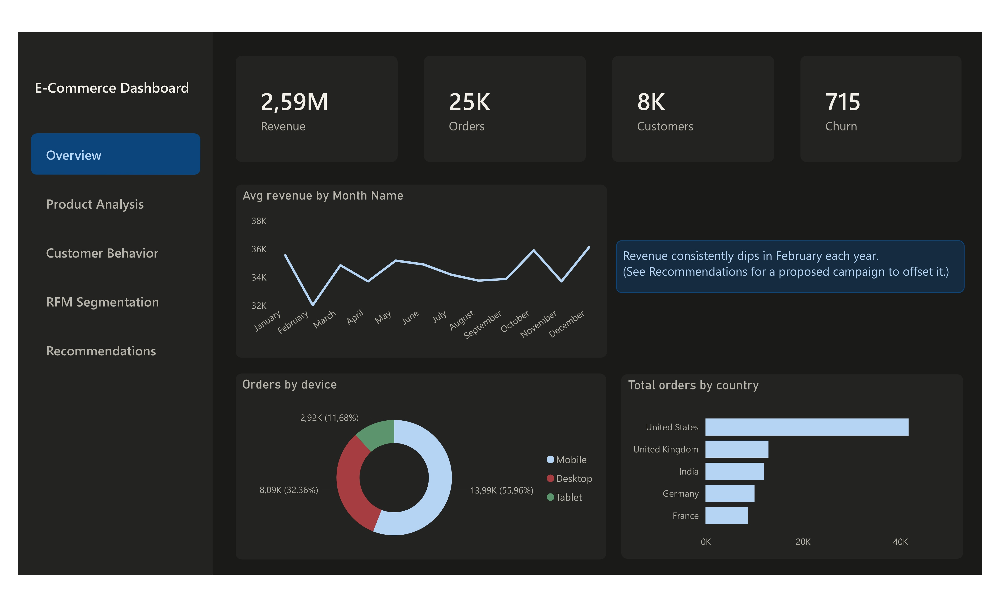
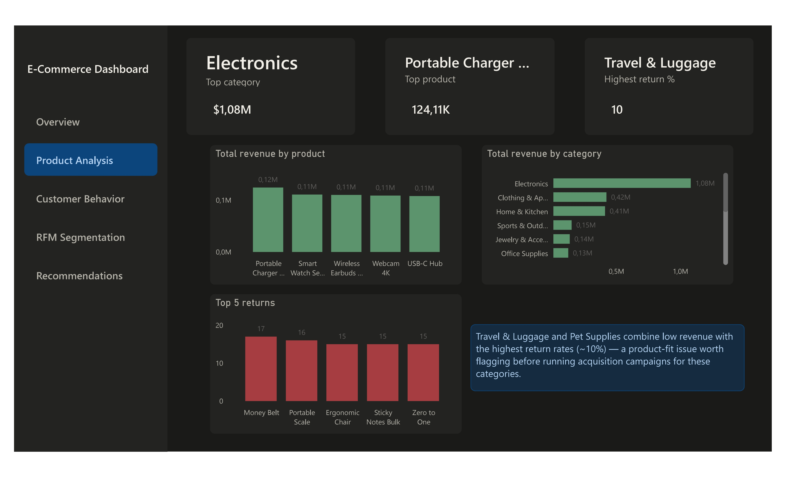
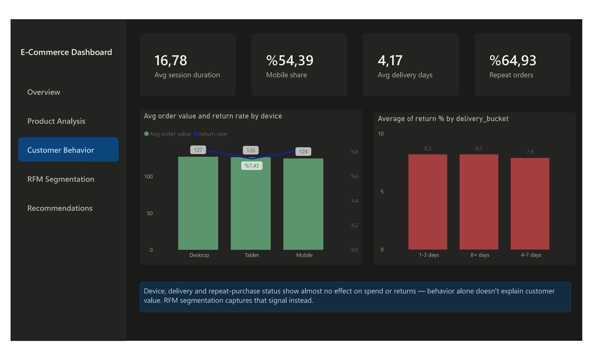
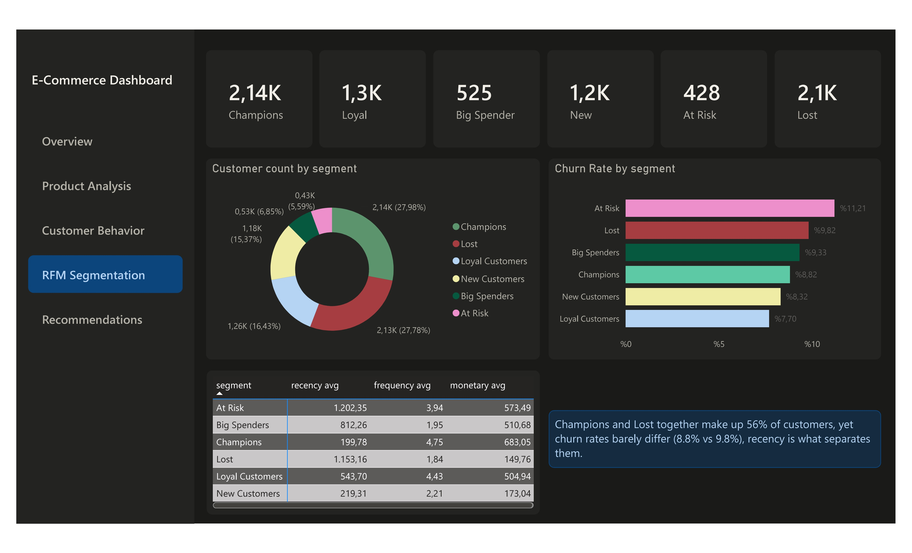
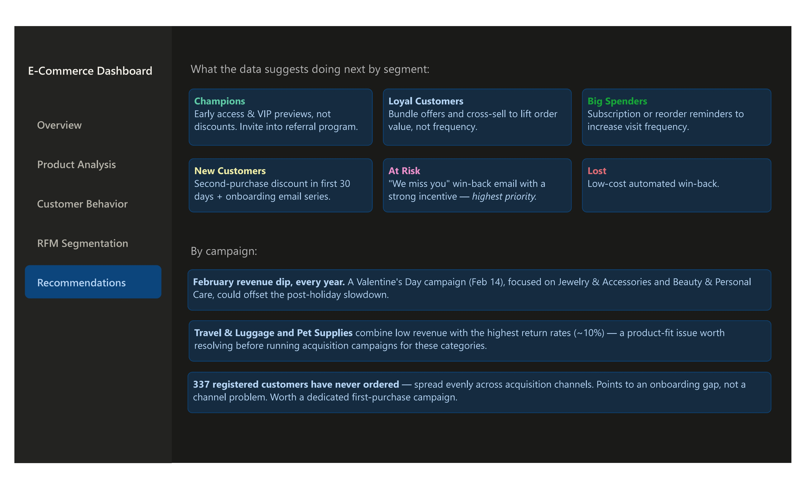

# Power BI Dashboard Notes
 
This document covers the Power BI dashboard built on top of the SQL analysis described in the main README. It's organized page by page, matching the dashboard's own navigation, with the DAX measures / Power Query steps / SQL queries used for each.
 
## Page: Overview
 

 
High-level KPIs (revenue, orders, customers, churn), monthly revenue trend, device split, and orders by country.
 
- **Month Name (calculated column)**, used to get proper month labels on the revenue trend chart instead of numeric months:
```dax
  Month Name = FORMAT(DATE(2000, monthly_revenue[month], 1), "MMMM")
```
  After adding the column, set **Sort by Column** (via Column tools in table view) so months display in calendar order (Jan → Dec) instead of alphabetically.
 
## Page: Product Analysis
 

 
Top category and top product cards, revenue by product/category, and top 5 return-rate products.
 
- **Top category by revenue:**
```sql
  SELECT category, SUM(total_revenue_usd) AS total_revenue
  FROM product_summary
  GROUP BY category
  ORDER BY total_revenue DESC
  LIMIT 1;
```
- **Best seller product:**
```sql
  SELECT product_name, total_revenue_usd
  FROM product_summary
  ORDER BY total_revenue_usd DESC
  LIMIT 1;
```
 
## Page: Customer Behavior
 

 
KPI cards (session duration, mobile share, delivery days, repeat orders), order value/return rate by device, and return rate by delivery bucket.
 
- **Mobile Percentage** (used for the "Mobile share" KPI card):
```dax
  Mobile Percentage = 
  DIVIDE(
      CALCULATE(COUNTROWS('Table'), 'Table'[device] = "mobile"),
      COUNTROWS('Table'),
      0
  )
```
- **Repeat Customer %** (used for the "Repeat orders" KPI card):
```dax
  Repeat Customer % = 
  DIVIDE(
      CALCULATE(
          COUNTROWS('public orders'),
          'public orders'[is_repeat_customer] = TRUE()
      ),
      COUNTROWS('public orders'),
      0
  )
```
- **Return Rate** (used in the "Avg order value and return rate by device" chart):
```dax
  Return Rate = 
  DIVIDE(
      CALCULATE(COUNTROWS('public orders'), 'public orders'[returned] = TRUE),
      COUNTROWS('public orders'),
      0
  )
```
- **Delivery bucket** (used in the "Average of return % by delivery_bucket" chart):
```sql
  SELECT
      CASE
          WHEN delivery_days <= 3 THEN '1-3 days'
          WHEN delivery_days <= 7 THEN '4-7 days'
          ELSE '8+ days'
      END AS delivery_bucket,
      COUNT(*) AS order_count,
      ROUND(100.0 * SUM(CASE WHEN returned THEN 1 ELSE 0 END) / COUNT(*), 1) AS return_rate_pct
  FROM orders
  GROUP BY delivery_bucket
  ORDER BY delivery_bucket;
```
 
## Page: RFM Segmentation
 

 
Segment KPI cards, customer count by segment, churn rate by segment, and the recency/frequency/monetary averages table.
 
- **Relationship setup:** in Model view, a relationship was created between `customers.customer_id` and `rfm_segmented.customer_id` (if not already present). This lets segment info be cross-filtered against customer demographic fields (e.g. `membership_tier`, `churned`).
- **Per-segment count measures** (one per segment, used for the KPI cards and donut):
```dax
  Champions Count = CALCULATE(COUNTROWS('public rfm_segmented'), 'public rfm_segmented'[segment] = "Champions")
```
  (repeated the same pattern for Loyal Customers, Big Spenders, New Customers, At Risk, and Lost)
- **Churn Rate** (used in the "Churn Rate by segment" chart):
```dax
  Churn Rate = DIVIDE(CALCULATE(COUNTROWS(customers), customers[churned] = TRUE), COUNTROWS(customers))
```
 
## Page: Recommendations
 

 
Static text cards translating the RFM segments and campaign findings into concrete next-step recommendations (per-segment actions, plus the February revenue dip, Travel & Luggage / Pet Supplies return issue, and the 337-never-ordered customer group) — see the README for the full write-up.
 
